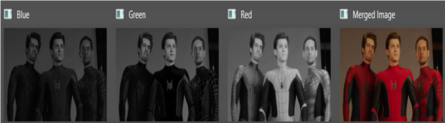

# Color Conversion
## Aim:
To perform the color conversion between RGB, BGR, HSV, and YCbCr color models.

## Software Required:
Anaconda - Python 3.7
## Algorithm:
### Step 1:
Import cv2 library.
### Step 2:
Use cv2.cvtcolor() to convert color in required image.
### Step 3:
Use .imshow() to display and .imwrite() to save.
### Step 4:
Use split() to disperse color into separate channels.
### Step 5:
Use merge() to combine those separate channels into color.

## Program:
~~~
Developed By: ragul A C
Register Number: 212221240042
~~~
### i) Convert BGR and RGB to HSV and GRAY:
~~~
import cv2
image = cv2.imread('pic.jpg')
cv2.imshow('Original image - Syed Abdul Wasih 212221240057',image)
#BGR2HSV
hsv_image = cv2.cvtColor(image,cv2.COLOR_BGR2HSV)
cv2.imshow('BGR2HSV',hsv_image)
#RGB2HSV
hsv_image1 = cv2.cvtColor(image,cv2.COLOR_RGB2HSV)
cv2.imshow('RGB2HSV',hsv_image1)
#BGR2Gray
gray_image = cv2.cvtColor(image,cv2.COLOR_BGR2GRAY)
cv2.imshow('BGR2GRAY',gray_image)
#RGB2Gray
gray_image1 = cv2.cvtColor(image,cv2.COLOR_RGB2GRAY)
cv2.imshow('RGB2GRAY',gray_image1)
cv2.waitKey(0)
cv2.destroyAllWindows()
~~~
### ii)Convert HSV to RGB and BGR:
~~~
import cv2
image = cv2.imread('pic.jpg')
#HSV to RGB
RGB_image = cv2.cvtColor(image,cv2.COLOR_HSV2RGB)
cv2.imshow('HSV to RGB',RGB_image)
#HSV to BGR
BGR_image = cv2.cvtColor(image,cv2.COLOR_HSV2BGR)
cv2.imshow('HSV to BGR',BGR_image)

cv2.waitKey(0)
cv2.destroyAllWindows()
~~~
### iii)Convert RGB and BGR to YCrCb:
~~~
import cv2
image = cv2.imread('pic.jpg')
#RGB to YCrCb
YCrCb_image = cv2.cvtColor(image,cv2.COLOR_RGB2YCrCb)
cv2.imshow('RGB to YCrCb',YCrCb_image)
#BGR to YCrCb
YCrCb_image = cv2.cvtColor(image,cv2.COLOR_BGR2YCrCb)
cv2.imshow('BGR to YCrCb',YCrCb_image)

cv2.waitKey(0)
cv2.destroyAllWindows()
~~~
### iv)Split and Merge RGB Image:
~~~
import cv2
image = cv2.imread('pic.jpg')
blue = image[:,:,0]
green = image[:,:,1]
red = image[:,:,2]
cv2.imshow('Blue',blue)
cv2.imshow('Green',green)
cv2.imshow('Red',red)
merge=cv2.merge((blue,green,red))
cv2.imshow('Merged Image',merge)
cv2.waitKey(0)
cv2.destroyAllWindows()
~~~
### v) Split and merge HSV Image:
~~~
import cv2
image = cv2.imread('pic.jpg')
hsv = cv2.cvtColor(image, cv2.COLOR_RGB2HSV)
h,s,v = cv2.split(hsv)
cv2.imshow('Hue',h)
cv2.imshow('Saturation',s)
cv2.imshow('Value',v)
merged_HSV = cv2.merge((h,s,v))
cv2.imshow('Merged HSV Image',merged_HSV)
cv2.waitKey(0)
cv2.destoryAllWindows()
~~~
## Output:
### i) BGR and RGB to HSV and gray:

### ii) HSV to RGB and BGR:

### iii) RGB and BGR to YCrCb:

### iv) Split and merge RGB Image:

### v) Split and merge HSV Image:

## Result:
Thus the color conversion was performed between RGB, HSV and YCbCr color models.
